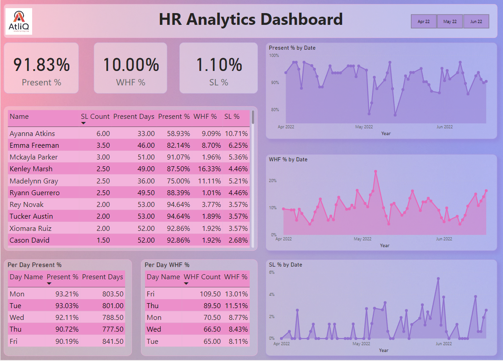

# POWER_BI_HR_Analystics_Dashboard
Altliq Technologies HR Analytics Dashboard project! This Power BI dashboard provides insightful visualizations based on real-time attendance data for Altliq employees from April to June 2022.

# Objective:
The objective of this project is to empower Altliq Technologies with a comprehensive HR Analytics Dashboard, offering actionable insights for effective human resources management. From data cleaning and transformation using Power Query to DAX-powered calculations and visualizations in Power BI, this project aims to enhance decision-making by providing a clear overview of attendance patterns and trends.

# Project Overview:
* Data Source:
  
The dataset, available in Excel format, includes employee code, names, and dates for a three-month period, with each date represented in separate columns.

* Data Preparation:
  
The initial step involves importing the data into Power BI and performing essential data cleaning tasks, such as removing duplicates.

* Data Transformation:
  
Extensive data transformation takes place in Power Query, including unpivoting dates into a single column. This process is applied across all sheets in the dataset.

* Data Analysis and Visualization:

Leveraging DAX functions like SWITCH, SUM, CALCULATE, DIVIDE, and FORMAT, the dashboard calculates crucial metrics such as total working days, present days, WFH count, and sick leave count.

* Key Metrics and Visualizations:
  
The dashboard showcases key performance indicators (KPIs) like Present %, WFH %, and Sick Leave %. Additionally, detailed tables provide per-day percentages for Present %, WFH %, and line graphs depict trends over time.
